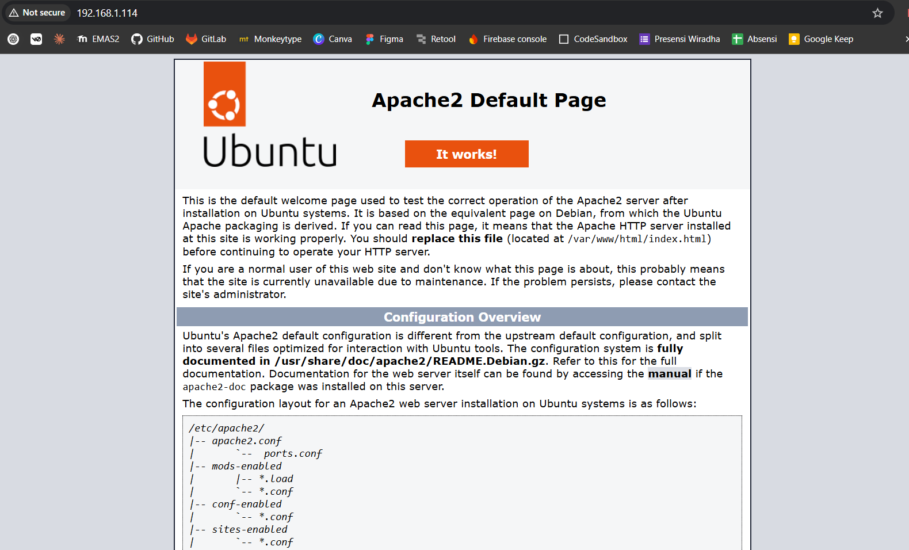

# Instalasi dan Konfigurasi Apache CloudStack
Kelompok 8:
- Hafizyah Rayhan Zulikhram (2206029185)
- Monica Vierin Pasman (2206029405)
- Muhammad Fahish Haritsah (2206059616)
- Valentino Farish Adrian (2206825896)
- Stefanus Simon Rilando (2206830422)

## Link Video
```
YouTube: https://youtu.be/ib8KVxeeaJU?si=FbF6ZzbK7qLyqMop
```

## Dasar Teori
### CloudStack
Apache CloudStack merupakan perangkat lunak open-source yang dirancang untuk membangun, menjalankan, dan mengelola jaringan besar sebagai platform komputasi awan IaaS (Infrastructure as a Service). CloudStack digunakan oleh banyak penyedia layanan dan perusahaan untuk menawarkan layanan cloud publik, layanan cloud on-premises/private, atau sebagai solusi dari hybrid cloud. Pengguna dapat mengelola cloud-nya sendiri melalui antarmuka web (GUI), command line (CLI), dan full-featured RESTful API. API yang disediakan telah kompatibel dengan AWS EC2 dan S3 bagi organisasi yang ingin men-deploy hybrid cloud. Platform ini menyediakan lapisan orkestrasi yang otomatis membuat dan mengatur komponen-komponen infrastruktur virtual, serta mengubah infrastruktur virtual tersebut menjadi platform cloud IaaS yang siap digunakan. Fitur-fitur yang disediakan CloudStack terdiri dari:
- Pengelolaan otomatis dalam pembuatan dan penghapusan VM;
- Manajemen jaringan virtual (router, firewall, load balancer, dan IP publik);
- Dukungan multi-tenant (banyak pengguna dan organisasi); serta
- Perhitungan penggunaan sumber daya (CPU, RAM, dan penyimpanan) per pengguna.


### TailScale
Tailscale adalah solusi VPN berbasis WireGuard yang memudahkan pembuatan jaringan privat antar perangkat secara otomatis dan aman, tanpa perlu konfigurasi firewall atau port forwarding yang rumit. Dalam konteks ini, Tailscale dapat digunakan untuk perangkat administrator secara aman melalui jaringan privat, sehingga memudahkan akses remote, monitoring, dan manajemen infrastruktur cloud dari mana saja.

### KVM
KVM (Kernel-based Virtual Machine) adalah teknologi virtualisasi open-source yang terintegrasi langsung dengan kernel Linux. KVM memungkinkan satu server fisik menjalankan banyak mesin virtual (VM) dengan performa mendekati bare-metal. Dalam penerapan cloud IaaS menggunakan Apache CloudStack, KVM berperan sebagai hypervisor utama untuk menjalankan dan mengelola VM yang disediakan kepada pengguna, sehingga memungkinkan isolasi, alokasi sumber daya dinamis, dan skalabilitas infrastruktur cloud.

## Libvirt
Libvirt merupakan sebuah toolkit dan API open-source yang digunakan untuk mengelola teknologi virtualisasi. Libvirt menyediakan antarmuka terpadu untuk mengontrol berbagai jenis hypervisor, seperti KVM (Kernel-based Virtual Machine), QEMU, Xen, VMware, dan lainnya. Libvirt berperan sebagai lapisan abstraksi yang memungkinkan layanan cloud seperti OpenStack untuk mengatur lifecycle VM secara otomatis dan terintegrasi.

## Server NFS 
Network File System (NFS) adalah sebuah protokol jaringan yang memungkinkan sebuah sistem komputer untuk mengakses file dan direktori yang terletak pada komputer lain seolah-olah file tersebut berada pada sistem lokal. NFS digunakan untuk menyediakan layanan penyimpanan terpusat yang dapat diakses oleh banyak client atau mesin virtual (VM) secara bersamaan. Fungsi Server NFS:
- Penyimpanan terpusat pada satu lokasi (server), namun dapat digunakan oleh banyak sistem client.
- Kolaborasi Multi-Client sehingga beberapa VM atau container dapat mengakses dan memodifikasi file yang sama secara bersamaan.
- Memungkinkan distribusi penyimpanan yang fleksibel dan dapat diakses oleh berbagai node dalam jaringan

## Computing Environment
### System Requirement
```
RAM: 24 GB
Storage: 250GB
CPU: Intel Core i5 gen 8
Network: Ethernet 100GB/s
OS: Ubuntu Live Server 22.04
```

### IP Address
```
Network Adress: 192.168.1.0/24
Gateway Address: 192.168.1.1
Host IP Address: 192.168.1.10/24
Host Tailscale IP Address: 100.66.37.47/32
```

## Konfigurasi Jaringan
### Definisikan Konfigurasi Jaringan dengan Netplan pada /etc/netplan
```
cd /etc/netplan
sudo nano
```

### Edit File dengan Menetapkan Bridge 
```
# Updated in 28/4/2025
network:
  version: 2
  ethernets:
    enp1s0:
      dhcp4: true
      dhcp6: false # Disable IPv6, could change it for later uses
      optional: true
  bridges:
    cloudbr0:
      addresses: [192.168.1.10/24] # host IP address
      routes:
        - to: default
          via: 192.168.1.1
      nameservers:
        addresses: [1.1.1.1,8.8.8.8]
      interfaces: [enp1s0]
      dhcp4: false
      dhcp6: false
      parameters:
        stp: false
        forward-delay: 0
```

### Terapkan Konfigurasi Jaringan
```
sudo -i  #buka shell baru dengan hak akses root
netplan generate #menghasilkan file konfigurasi untuk renderer
netplan apply  #menerapkan konfigurasi jaringan ke sistem
reboot #restart sistem
```
> Untuk memeriksa apakah konfigurasi jaringan sudah diterapkan, gunakan perintah `ifconfig` dan cari interface `br0`. Pastikan alamat IP-nya sesuai dengan yang sudah diatur.

### Uji Jaringan dengan Memastikan bahwa Konfigurasi Sudah Diterapkan
```
ifconfig     #cek alamat IP dan interface yang ada
ping -c 20 google.com  #pastikan dapat terhubung ke internet
```
> Jika tidak bisa ping ke google.com, coba ping ke gateway dan 8.8.8.8.
> Langkah ini akan membantu mengetahui masalah koneksi antara komputer dan internet, pastikan tidak ada masalah karena akan mengunduh paket dari internet.

### Masuk ke Sistem sebagai Root
```
su -
```

### Install Alat Monitoring Sumber Daya Hardware
```
apt update -y
apt upgrade -y
apt install htop lynx duf -y
apt install bridge-utils
```
* htop adalah alat monitoring penggunaan CPU
* duf adalah alat monitoring penggunaan disk
* lynx adalah browser web berbasis CLI

### Konfigurasi LVM (Opsional)
```
# Tidak wajib kecuali menggunakan logical volume
lvextend -l +100%FREE /dev/ubuntu-vg/ubuntu-lv
resize2fs /dev/ubuntu-vg/ubuntu-lv
```

### Install Layanan Jaringan
```
apt-get install openntpd openssh-server sudo tar -y
apt-get install intel-microcode -y
passwd root
#ganti password root, misal: Pa$$w0rd
```
* openntpd adalah klien NTP untuk sinkronisasi waktu antara host dan internet
* openssh-server adalah server SSH untuk akses remote
* tar adalah alat kompresi dan dekompresi file, sering digunakan untuk file yang diunduh
* intel-microcode adalah kumpulan prosedur untuk meningkatkan modularitas tingkat rendah pada prosesor Intel

### Aktifkan Login Root via SSH
```
sed -i '/#PermitRootLogin prohibit-password/a PermitRootLogin yes' /etc/ssh/sshd_config
#restart layanan ssh
service ssh restart
#atau
systemctl restart sshd.service
```

### Periksa Konfigurasi SSH
```
nano /etc/ssh/sshd_config
```
Cari baris `PermitRootLogin` dan pastikan nilainya `yes`

## Instalasi Tailscale
```
curl -fsSL https://tailscale.com/install.sh | sh   # Unduh dan instalasi Tailscale
tailscale up                                       # Aktifkan Tailscale dan login dengan akun 
```
Setelah menjalankan perintah di atas, ikuti instruksi pada terminal untuk login ke akun Tailscale melalui browser. Setelah berhasil login, server akan terhubung ke jaringan privat Tailscale dan dapat diakses dari perangkat lain yang juga terhubung ke jaringan yang sama.

## Instalasi CloudStack
### Import Key Repository dari CloudStack
```
sudo -i
mkdir -p /etc/apt/keyrings 
wget -O- http://packages.shapeblue.com/release.asc | gpg --dearmor | sudo tee /etc/apt/keyrings/cloudstack.gpg > /dev/null
echo deb [signed-by=/etc/apt/keyrings/cloudstack.gpg] http://packages.shapeblue.com/cloudstack/upstream/debian/4.18 / > /etc/apt/sources.list.d/cloudstack.list
```
* Baris pertama membuat direktori untuk menyimpan kunci publik cloudstack.
* Perintah wget -O digunakan untuk mengunduh URL dan mengarahkan output ke perintah `gpg --dearmor`.
* Perintah `gpg --dearmor` mengubah format ASCII menjadi format biner.
* Perintah `sudo tee` mengarahkan hasil ke file `/etc/apt/keyrings/cloudstack.gpg`.

### Periksa Repositori yang Ditambahkan
```
nano /etc/apt/sources.list.d/cloudstack.list
```
Pastikan terdapat baris berikut pada bagian akhir file:
```
deb [signed-by=/etc/apt/keyrings/cloudstack.gpg] http://packages.shapeblue.com/cloudstack/upstream/debian/4.18 /
```

### Install CloudStack dan MySQL Server
```
apt-get update -y
apt-get install cloudstack-management mysql-server
```

### Konfigurasi MySQL
#### Buka file konfigurasi MySQL
```
nano /etc/mysql/mysql.conf.d/mysqld.cnf
```

#### Tambahkan baris berikut di bawah bagian [mysqld]
```
server-id = 1
sql-mode="STRICT_TRANS_TABLES,NO_ENGINE_SUBSTITUTION,ERROR_FOR_DIVISION_BY_ZERO,NO_ZERO_DATE,NO_ZERO_IN_DATE,NO_ENGINE_SUBSTITUTION"
innodb_rollback_on_timeout=1
innodb_lock_wait_timeout=600
max_connections=1000
log-bin=mysql-bin
binlog-format = 'ROW'
```

#### Restart layanan MySQL
```
systemctl restart mysql
```

#### Cek status layanan MySQL
```
systemctl status mysql
```
Pastikan statusnya 'active'.

### Deploy Database sebagai Root dan Buat User `cloud` dengan Password `cloud`
```
cloudstack-setup-databases cloud:cloud@localhost --deploy-as=root:Pa$$w0rd -i 192.168.1.10
```

### Konfigurasi Primary dan Secondary Storage
```
apt-get install nfs-kernel-server quota
echo "/export  *(rw,async,no_root_squash,no_subtree_check)" > /etc/exports
mkdir -p /export/primary /export/secondary
exportfs -a
```

### Konfigurasi NFS Server
```
sed -i -e 's/^RPCMOUNTDOPTS="--manage-gids"$/RPCMOUNTDOPTS="-p 892 --manage-gids"/g' /etc/default/nfs-kernel-server
sed -i -e 's/^STATDOPTS=$/STATDOPTS="--port 662 --outgoing-port 2020"/g' /etc/default/nfs-common
echo "NEED_STATD=yes" >> /etc/default/nfs-common
sed -i -e 's/^RPCRQUOTADOPTS=$/RPCRQUOTADOPTS="-p 875"/g' /etc/default/quota
service nfs-kernel-server restart
```
**Penjelasan:**
- Perintah `sed` digunakan untuk mengubah konfigurasi port dan opsi pada file konfigurasi NFS.
- `echo "NEED_STATD=yes"` menambahkan baris agar layanan statd aktif.
- `service nfs-kernel-server restart` untuk me-restart layanan NFS.
> Pastikan semua konfigurasi sudah sesuai dengan IP server (`192.168.1.10`) dan storage sudah tersedia sebelum melanjutkan ke konfigurasi CloudStack berikutnya.

### Konfigurasi Hypervisor KVM
#### Install KVM dan agen CloudStack
```
apt-get install qemu-kvm cloudstack-agent -y
```

#### Konfigurasi manajemen virtualisasi KVM dengan libvirt
```
sed -i -e 's/\#vnc_listen.*$/vnc_listen = "0.0.0.0"/g' /etc/libvirt/qemu.conf

# Pada versi Ubuntu 22.04, sebaiknya tambahkan LIBVIRTD_ARGS="--listen" ke /etc/default/libvirtd 
sed -i.bak 's/^\(LIBVIRTD_ARGS=\).*/\1"--listen"/' /etc/default/libvirtd
```
> Command di atas berfungsi untuk mengaktifkan akses VNC melalui alamat IP mana pun agar GUI VM yang dijalankan QEMU dapat diakses dari luar via VNC client dari jaringan lain. Command selanjutnya digunakan agar libvirt mendengar koneksi TCP yang dibangun oleh klien remote. 

```
echo 'listen_tls=0' >> /etc/libvirt/libvirtd.conf
echo 'listen_tcp=1' >> /etc/libvirt/libvirtd.conf
echo 'tcp_port = "16509"' >> /etc/libvirt/libvirtd.conf
echo 'mdns_adv = 0' >> /etc/libvirt/libvirtd.conf
echo 'auth_tcp = "none"' >> /etc/libvirt/libvirtd.conf
```
> Command di atas bertujuan untuk menambahkan konfigurasi tertentu ke file `libvirtd.conf`. Setiap baris memiliki fungsi untuk: (1) menonaktifkan TLS (SSL); (2) mengaktifkan koneksi TCP agar libvirt dapat menerima koneksi remote; (3) mengatur port TCP ke port default libvirt dalam koneksi TCP; (4) menonaktifkan pengumuman otomatis via mDNS; serta (5) tidak menggunakan autentikasi TCP apapun. 

```
systemctl mask libvirtd.socket libvirtd-ro.socket libvirtd-admin.socket libvirtd-tls.socket libvirtd-tcp.socket
systemctl restart libvirtd
```
> Command di atas digunakan untuk memastikan bahwa soket libvirt tidak digunakan dan memulai ulang libvirtd agar semua perubahan konfigurasi dapat diterapkan. 

### Konfigurasi Docker Support dan Layanan Lainnya
```
echo "net.bridge.bridge-nf-call-arptables = 0" >> /etc/sysctl.conf
echo "net.bridge.bridge-nf-call-iptables = 0" >> /etc/sysctl.conf
sysctl -p
```
**Penjelasan:**
- Mengatur agar paket ARP dan IP yang melalui bridge tidak diproses oleh arptables dan iptables, menghindari konflik dengan container seperti Docker yang memakai bridge networking.
- ```sysctl -p``` untuk menerapkan konfigurasi tersebut.

### Hasilkan ID Host yang Unik
```
apt-get install uuid -y
UUID=$(uuid)
echo host_uuid = \"$UUID\" >> /etc/libvirt/libvirtd.conf
systemctl restart libvirtd
```
> UUID digunakan oleh libvirtd untuk mengidentifikasi host secara unik dalam lingkungan virtualisasi. Konfigurasi ditambahkan ke libvirtd.conf, layanan perlu di-restart.

### Konfigurasi Firewall Iptables Secara Permanen
```
NETWORK=192.168.1.0/24
iptables -A INPUT -s $NETWORK -m state --state NEW -p udp --dport 111 -j ACCEPT
iptables -A INPUT -s $NETWORK -m state --state NEW -p tcp --dport 111 -j ACCEPT
iptables -A INPUT -s $NETWORK -m state --state NEW -p tcp --dport 2049 -j ACCEPT
iptables -A INPUT -s $NETWORK -m state --state NEW -p tcp --dport 32803 -j ACCEPT
iptables -A INPUT -s $NETWORK -m state --state NEW -p udp --dport 32769 -j ACCEPT
iptables -A INPUT -s $NETWORK -m state --state NEW -p tcp --dport 892 -j ACCEPT
iptables -A INPUT -s $NETWORK -m state --state NEW -p tcp --dport 875 -j ACCEPT
iptables -A INPUT -s $NETWORK -m state --state NEW -p tcp --dport 662 -j ACCEPT
iptables -A INPUT -s $NETWORK -m state --state NEW -p tcp --dport 8250 -j ACCEPT
iptables -A INPUT -s $NETWORK -m state --state NEW -p tcp --dport 8080 -j ACCEPT
iptables -A INPUT -s $NETWORK -m state --state NEW -p tcp --dport 8443 -j ACCEPT
iptables -A INPUT -s $NETWORK -m state --state NEW -p tcp --dport 9090 -j ACCEPT
iptables -A INPUT -s $NETWORK -m state --state NEW -p tcp --dport 16514 -j ACCEPT
#iptables -A INPUT -s $NETWORK -m state --state NEW -p udp --dport 3128 -j ACCEPT
#iptables -A INPUT -s $NETWORK -m state --state NEW -p tcp --dport 3128 -j ACCEPT

apt-get install iptables-persistent
```
> input y/n isi dengan yes dan yes
**Penjelasan:**
- Membuka port yang digunakan CloudStack dan layanan terkait (seperti NFS, libvirt, KVM) untuk jaringan lokal 192.168.101.0/24.
- -m state --state NEW: hanya berlaku untuk koneksi yang baru masuk.
- apt-get install iptables-persistent: menyimpan aturan iptables agar tetap aktif setelah reboot.

### Matikan AppArmor pada libvirtd
```
ln -s /etc/apparmor.d/usr.sbin.libvirtd /etc/apparmor.d/disable/
ln -s /etc/apparmor.d/usr.lib.libvirt.virt-aa-helper /etc/apparmor.d/disable/
apparmor_parser -R /etc/apparmor.d/usr.sbin.libvirtd
apparmor_parser -R /etc/apparmor.d/usr.lib.libvirt.virt-aa-helper
```
**Penjelasan:**
- AppArmor adalah sistem keamanan berbasis profil. Untuk mempermudah pengelolaan libvirtd, profilnya dinonaktifkan.
- Menggunakan symbolic link ke folder disable dan menghapus profil dari kernel dengan apparmor_parser -R.

### Luncurkan Management Server
```
cloudstack-setup-management
systemctl status cloudstack-management
tail -f /var/log/cloudstack/management/management-server.log
```
> cloudstack-setup-management digunakan untuk menginisialisasi server manajemen CloudStack (konfigurasi DB, IP, dan service). Command di bawahnya akan mengecek status layanan CLoudStack dan memantau log secara langsung untuk troubleshooting.

### Buka Web Browser untuk Mengakses Dashboard
```
http://<IP-ADDRESS>:8080
```
> Ganti nilai `IP-ADDRESS` dengan alamat IP lokal milik host atau alamat IP Tailscale milik host untuk akses dashboard admin CloudStack dari jarak jauh. 

## Setup GUI CloudStack
### Buat Zona Baru
- Klik icon menu pada bagian kiri atas.
- Pilih Infrastructure > Zones > Add zone.
- Pada tab `Zone type`, pilih `core`.
- Pada tab `Core zone type`, pilih `basic` untuk membentuk zona **shared network**.
  > Instance VM yang dibuat dalam zona jenis ini akan berada dalam jaringan yang sama dengan host CloudStack (hypervisor KVM). Instance akan bergantung dengan host melalui bridged `cloudbr0`.
- Isi `Zone details` sesuai dengan konfigurasi awal ketika meng-install CloudStack.

- Pada tab `Network`, langsung klik *next* pada bagian `Physical network`.
- Pada bagian `Pod` isi gateway dan netmask dengan alamat IP router. Gunakan alamat IP yang tersedia untuk mengisi sistem IP yang direservasi. 

- Pada bagian `Guest traffic`, isi gateway dan netmask guest dengan alamat IP router. Gunakan alamat IP yang tersedia untuk mengisi IP guest. Jangan gunakan alamat IP sistem. 

- Pada tab `Add resource`, isi nama kluster pada bagian `Cluster`.
- Pada bagian `IP address`, isi host name dengan alamat IP host.

- Pada bagian `Primary storage`, isi protokol dengan `nfs`. Alamat IP server yang dimaksud adalah server NFS (berada di dalam host). Isi path sesuai dengan direktori yang sudah dibuat ketika mengkonfigurasi server NFS. 

- Pada bagian `Secondary storage`, isi input tidak beda jauh dengan pengisian primary storage. 

- Setelah semua input telah diisi, zona siap diluncurkan dengan meng-klik tombol `Launch zone`.

**Additional Note**

Jika ingin membuat zona baru lainnya, buat direktori baru pada server NFS untuk dijadikan primary dan secondary storage menggunakan command berikut.
```
mkdir -p /export/primary_new /export/secondary_new
exportfs -a
service nfs-kernel-server restart
```

### Download ISO
- Klik icon menu pada bagian kiri atas.
- Pilih Images > ISOs > Register ISO.
- Masukkan URL untuk mengunduh ISO image yang diinginkan. Pada percobaan ini, dipilih Ubuntu 22.04 untuk mempermudah konfigurasi. Pilih zona yang sudah dibuat sebelumnya. 

- Proses pengunduhan ISO yang berhasil berjalan ditandai dengan state `Ready`.
- Persentase progress unduhan dapat dilihat pada tab `Zones`.

-  ISO yang berhasil diunduh dapat digunakan untuk membuat instance VM. 

### Tambahkan Compute Offering (Opsional)
Secara default, CloudStack sudah memberikan pilihan komputasi untuk `Small Instance` dan `Medium Instance`. Akan tetapi, spesifikasi komputasi instance VM dapat disesuaikan dengan kebutuhan dan preferensi pengguna melalui cara berikut ini. 
- Klik icon menu pada bagian kiri atas.
- Pilih Service offerings > Compute offerings > Add compute offering.
- Sesuaikan banyaknya core, serta besarnya CPU dan memori.

- Pilihan komputasi bertambah dan pengguna dapat memilih salah satu compute offering ketika membuat instance VM.


### Buat Instance
- Klik icon menu pada bagian kiri atas.
- Pilih Compute > Instances > Add instance.
- Pada `Select deployment infrastructure`, pilih zona yang telah dibuat sebelumnya. Misalnya `CLOUD8-NEW-ZONE`.

- Pada `Template/ISO`, pilih ISOs > My ISOs > Ubuntu 22.04 Live-Server. Gunakan hypervisor KVM.

- Pada `Compute offering`, pilih compute offering yang telah dibuat sebelumnya. Misalnya `Big Instance`.

- Pada `Disk size`, pilih yang paling sesuai dengan kebutuhan pengguna saat ini.

- Sisanya biarkan dalam pilihan default, lalu klik `Launch instance`.
- Instance VM yang telah berhasil dibuat akan menunjukkan state `Running`. Console VM hanya dapat diakses oleh perangkat yang satu jaringan dengan host dan VM. Jika ingin diakses dari luar dapat mengikuti tutorial di bawah ini. 

## Setup VM
### Cek Interface dan Alamat IP
Cek interface dan alamat IP yang terdaftar di VM menggunakan command `ip a`.
```
1: lo: <LOOPBACK,UP,LOWER_UP> ...
    inet 127.0.0.1/8 scope host lo
2: ens3: <BROADCAST,MULTICAST,UP,LOWER_UP> ...
    inet 192.168.1.114/24 metric 100 brd 192.168.1.255 scope global ens3
```

### Expose Subnet Route
#### Iklankan rute jaringan
Jalankan perintah berikut di laptop host pada jaringan `192.168.1.0/24` dan di perangkat yang telah login Tailscale.
```
sudo tailscale up --advertise-routes=192.168.1.0/24
````

#### Setujui rute dari konsol admin
Masuk ke [Tailscale Admin Console](https://login.tailscale.com/admin).
- Buka tab **Machines**.
- Cari perangkat host untuk advertise route.
- Klik **Review route** lalu **Enable** untuk subnet `192.168.1.0/24`.

#### Cek Konektivitas
Setelah route disetujui, perangkat lain di jaringan Tailscale akan dapat mengakses alamat IP host dalam subnet `192.168.1.0/24`.

Contoh:
```
ping 192.168.1.114
```

Aktifkan IP forwarding untuk akses dua arah.
```
sudo sysctl -w net.ipv4.ip_forward=1
```

### Buat SNAT Rules
#### Situasi saat ini 
- Laptop Host:
  - IP Lokal: `192.168.1.10`
  - IP Tailscale: `100.66.37.47`
- VM berjalan di dalam laptop host:
  - IP VM: `192.168.1.114`
- Perangkat luar di jaringan Tailscale:
  - IP Tailscale: `100.124.10.100` (laptop lain)
> Perangkat dengan IP Tailscale `100.124.10.100` ingin melakukan ping ke `192.168.1.114` (VM).

---

#### Masalah
- Ping dari `100.124.10.100` berhasil **masuk ke VM**, tetapi perangkat luar gagal mendapatkan **reply**.
- Setelah ditelusuri, reply dari VM tidak kembali ke `100.124.10.100`, tetapi malah dilempar ke **default gateway router** yang terhubung dengan host (`192.168.1.1`).
- Hal ini terjadi karena VM tidak mengenali IP Tailscale `100.124.10.100` sebagai bagian dari jaringan yang valid.

---

#### Penyebab
- Saat ping masuk, source IP-nya adalah `100.124.10.100`.
- VM tidak tahu harus mengirim balasan ke mana, karena tidak ada routing ke IP tersebut.
- Akibatnya, VM mengirim balasan ke default gateway (`192.168.1.1`) dan bukannya kembali melalui laptop host.

---

#### Solusi
Agar VM bisa mengenali sumber ping dan membalas melalui jalur yang benar, source IP perlu diubah saat paket diteruskan dari Tailscale ke VM. Caranya dengan menggunakan iptables SNAT (dalam bentuk MASQUERADE).

Tambahkan rule berikut di laptop host (bukan di VM).
```
sudo iptables -t nat -A POSTROUTING -o cloudbr0 -j MASQUERADE
````

Penjelasan:
* `-t nat`: mengatur tabel NAT
* `-A POSTROUTING`: menambahkan rule di tahap setelah routing diproses
* `-o cloudbr0`: interface virtual bridge (jaringan antara host dan VM)
* `-j MASQUERADE`: mengganti source IP menjadi IP dari interface tersebut (dalam hal ini `192.168.1.10`)

---

#### Hasil
Setelah rule diterapkan:
* Saat laptop lain (100.124.10.100) ping ke `192.168.1.114`, paket diteruskan dari Tailscale ke VM melalui laptop host.
* Source IP diubah dari `100.124.10.100` menjadi `192.168.1.10`.
* VM mengenali dan merespon ke IP `192.168.1.10`.
* Laptop host kemudian meneruskan kembali balasan ke `100.124.10.100` melalui Tailscale.

---

## Topologi Final


## Setup Layanan (SSH and HTTP via Apache) 
### Setup SSH 
#### Install server OpenSSH 
```
sudo apt install openssh-server -y
```

#### Cek status dan jalankan SSH
```
sudo systemctl status ssh
sudo systemctl enable ssh
sudo systemctl start ssh
```

#### Cek alamat IP untuk akses
```
ip a
```

Gunakan IP tersebut untuk akses SSH dari perangkat luar. 
```
ssh vm1@192.168.1.114
```

---

### Setup HTTP Service (Apache)
#### Install Apache2
```
sudo apt install apache2 -y
```

#### Cek status dan jalankan Apache
```
sudo systemctl status apache2
sudo systemctl enable apache2
sudo systemctl start apache2
```

#### Tes layanan di browser
Buka browser dan akses `http://localhost`. Jika dibuka dari perangkat lain, dapat mengakses layanan HTTP melalui `http://192.168.1.114`.


---


